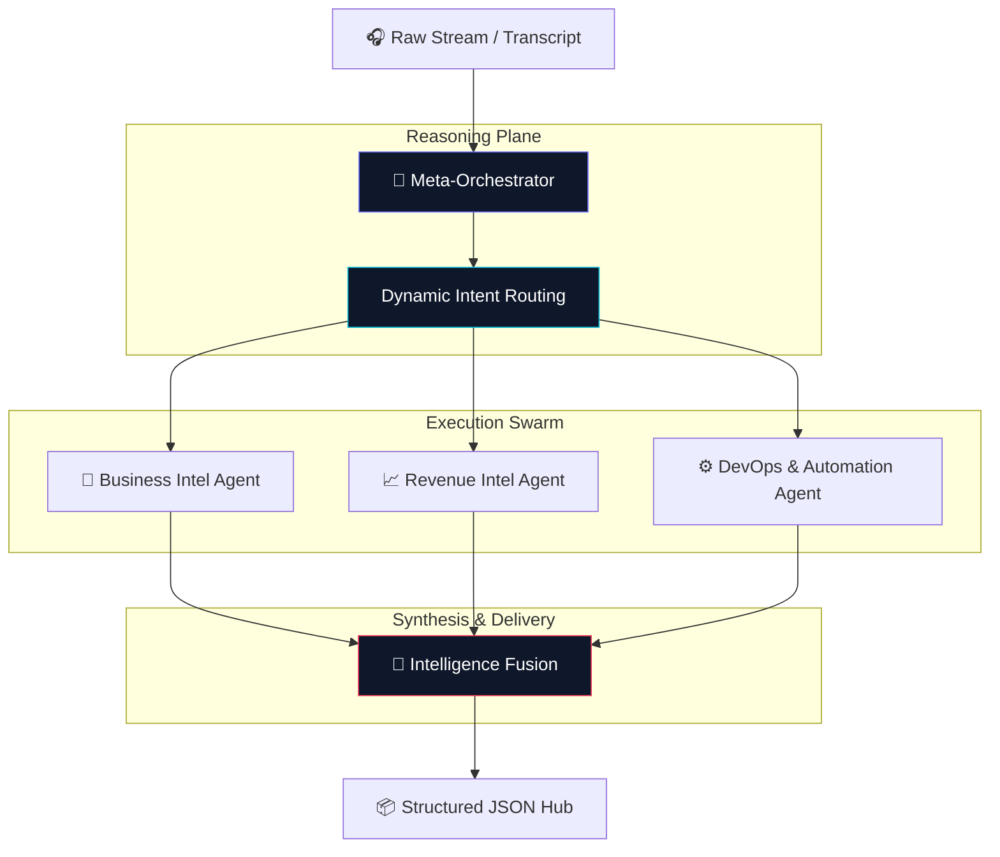

# 🧠 Nexus Intelligence
### *Autonomous Multi-Agent Orchestration for Business Synthesis*

[](https://github.com/Wajiz-pk)
[](https://github.com/Wajiz-pk)
[](LICENSE)

---

## 💎 The Vision
In the era of information overload, **Nexus Intelligence** serves as the definitive cognitive layer for business operations. It doesn't just "transcribe" or "summarize"—it **synthesizes**. By deploying a specialized swarm of autonomous agents, Nexus distills raw, messy conversations into high-fidelity, machine-readable strategic intelligence.

> "The signal is buried in the noise. Nexus is the filter."

---

## 🚀 Key Capabilities

### 🏛️ Meta-Intelligence Orchestrator
The neural center of the platform. It analyzes user intent and dynamically routes tasks to the most efficient agent specialized for the objective.

### 📈 Sales Alpha (MEDDIC/BANT)
A dedicated agent for revenue operations. It performs real-time deal health scoring, identifies decision-makers, and predicts win-probabilities using established enterprise frameworks.

### ⚙️ Automation Architect
Beyond insights, Nexus builds solutions. It identifies manual inefficiencies discussed in meetings and autonomously generates Python-based automation specs and ROI projections.

### 📝 Executive Synthesis
Bypasses the fluff. Generates C-suite summaries with weighted action items, decision logs, and priority-verified task lists.

---

## 🛠️ Technical Architecture

Nexus utilizes a proprietary **Planner-Executor-Synthesizer** loop, ensuring every piece of data is verified and contextualized before delivery.



---

## ⚡ Quick Start

### Deployment
```bash
# Clone the intelligence hub
git clone https://github.com/Wajiz-pk/Nexus-Intelligence.git

# Enter the nucleus
cd Nexus-Intelligence

# Initialize dependencies
pip install -r requirements.txt
```

### Execution
Trigger the orchestration engine from the CLI:
```bash
python main.py --request "Extract MEDDIC scores and action items" --file ./transcript.txt
```

---

## 🌐 Enterprise Ecosystem
Nexus is designed to be **Provider Agnostic**, supporting:
- **Anthropic** (Claude 3.5 Sonnet/Opus)
- **OpenAI** (GPT-4o)
- **DeepSeek** (V3 / R1)
- **Mistral** (Large 2)

---

## 🗺️ Product Roadmap
- [x] Multi-Agent Core Orchestration
- [x] Sales Intelligence Integration (MEDDIC)
- [ ] Real-time Webhook Support (Zoom/Teams)
- [ ] CRM Native Sync (Salesforce/HubSpot)
- [ ] Predictive Revenue Analytics Dashboard

---

### 🏛️ Credits & Contact
Nexus Intelligence is a vision-driven project developed by **Wajiz**.

[](https://wajiz.pk)
[](https://github.com/Wajiz-pk)

---
*Built for the future of agentic work.*
