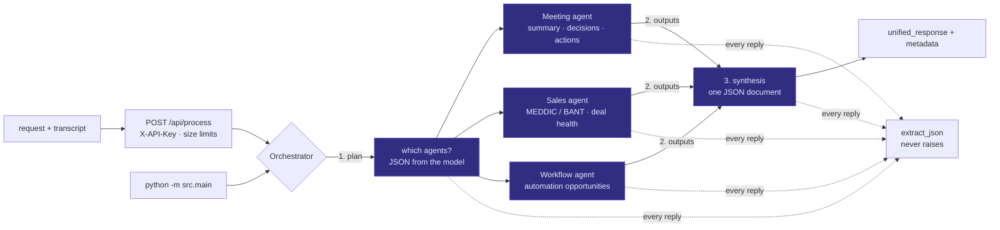

# Nexus Intelligence

[](https://github.com/daniellopez882/Autonomous-Multi-Agent-Orchestration-for-Business-Synthesis/actions/workflows/ci.yml)


Three specialist agents — meeting, sales, workflow — behind an orchestrator
that plans which of them a request needs, runs them over a transcript, and
synthesises one JSON document. Served as a FastAPI endpoint with a dashboard,
and as a CLI.

## At a glance

| | |
|---|---|
| **Does** | Plan → run the needed agents → synthesise: executive summary, decisions, action items, next steps; MEDDIC/BANT-style qualification with a model-assessed deal-health score; a written description of automation opportunities |
| **Does not** | Execute anything the workflow agent proposes; integrate with any CRM; persist anything |
| **Providers** | `anthropic` (model from `ANTHROPIC_MODEL`) and `openai` — any OpenAI-compatible base URL, DeepSeek by default (model from `OPENAI_MODEL`) |
| **Tests** | 100 — none reach a network or need a credential |
| **CI** | lint · tests · no `.env` and no key-shaped string may be tracked · bandit (fails the job) · gitleaks over full history · container built, run as non-root, refused on an unsafe production config |
| **Same code as** | [`Meeting-Intelligence-Agent`](https://github.com/daniellopez882/Meeting-Intelligence-Agent) — `src/` was byte-identical; the fixes there were ported here and three more were found in the porting |

## Architecture



### One request

```mermaid
sequenceDiagram
    autonumber
    participant D as Dashboard / client
    participant A as FastAPI
    participant O as Orchestrator
    participant L as Provider (Anthropic or OpenAI-compatible)

    D->>A: POST /api/process {request, content, provider} + X-API-Key
    A->>A: constant-time key check; request ≤ 2k chars, content ≤ 200k
    A->>O: process_request(request, content)
    O->>L: plan (system prompt + request + preview)
    L-->>O: {"orchestration_plan": {"agents_required": [...]}}
    loop each required agent
        O->>L: agent prompt + transcript
        L-->>O: agent JSON (parsed with extract_json)
    end
    O->>L: synthesis (plan + agent outputs)
    L-->>O: unified_response + metadata
    O-->>A: dict
    A-->>D: 200 JSON — or 401 / 422 / 503 / 500 with a request id
```

## Quick start

```bash
python -m venv .venv && . .venv/bin/activate     # Windows: .venv\Scripts\activate
pip install -r requirements.txt
cp .env.example .env      # add ANTHROPIC_API_KEY and/or OPENAI_API_KEY, and an API_KEY
```

Serve the API and the dashboard:

```bash
uvicorn src.api:app --reload
```

Open <http://127.0.0.1:8000/>, enter the `API_KEY` in the sidebar, paste a
transcript. Or from the shell — stdout is the JSON document and nothing else:

```bash
python -m src.main --request "Qualify this sales call" --file transcript.txt --provider anthropic | jq .
```

### Container

```bash
docker build -t nexus-intelligence .
docker run --rm -p 8000:8000 --env-file .env nexus-intelligence
```

With `ENVIRONMENT=production`, startup validates the configuration and exits
non-zero on the placeholder `API_KEY`, a missing provider key, or an empty
CORS allowlist.

## Configuration

| Variable | Default | Notes |
|---|---|---|
| `API_KEY` | `changeme-in-production` | Required by `/api/process`. Production refuses to start on the placeholder |
| `ANTHROPIC_API_KEY` · `ANTHROPIC_MODEL` | — · `claude-sonnet-5` | |
| `OPENAI_API_KEY` · `OPENAI_MODEL` · `OPENAI_BASE_URL` | — · `deepseek-chat` · `https://api.deepseek.com` | Any OpenAI-compatible endpoint |
| `LLM_TIMEOUT_SECONDS` · `LLM_MAX_RETRIES` | `60` · `2` | Applied to both SDK clients |
| `CORS_ALLOW_ORIGINS` | *(empty)* | Comma-separated. Empty in production means no browser origin |
| `ENVIRONMENT` | `development` | `production` enables the startup check and hides `/docs` |

## API

| Route | Auth | Purpose |
|---|:-:|---|
| `POST /api/process` | key | `{"request", "content", "provider": "openai" \| "anthropic"}` → the synthesised document |
| `GET /health` | — | Liveness |
| `GET /ready` | — | Readiness: provider credentials, API key posture, static assets |
| `GET /` | — | The dashboard |

## What changed, and why

Every defect below was reproduced before it was fixed.

| # | Defect | Effect |
|--:|---|---|
| 1 | `/api/process` accepted any caller | Anyone reaching the port could spend the model credit |
| 2 | `content` had no size limit | One request could carry an arbitrarily large transcript into a model call |
| 3 | Four copies of a hand-rolled JSON parser, each with the same four bugs | Two inputs *raised* out of a function whose contract was to return an error dict |
| 4 | `detail=str(e)` on every 500 | Provider exceptions carry endpoint URLs and sometimes key fragments |
| 5 | `allow_origins=["*"]` with credentials | Any page in any browser could call the endpoint |
| 6 | `generate()` hardcoded `claude-3-5-sonnet-20240620` | A retired model; `ANTHROPIC_MODEL` existed and was read by nothing |
| 7 | `LLM_TIMEOUT_SECONDS` / `LLM_MAX_RETRIES` declared, never applied | A hung provider connection hung the request |
| 8 | Progress and errors `print()`ed to **stdout** | The CLI's JSON output had prose mixed into it |
| 9 | The dashboard never sent the key | Every submission a 401 once auth existed |
| 10 | On any error the page showed `98%` confidence, `1` agent, `4.0s` "Synthesis Time" | Fabricated numbers, from `||` defaults, on a field the API never produces |
| 11 | Model output written to `innerHTML` unescaped | A transcript that makes the model echo HTML runs it in the browser |

<details>
<summary>Also</summary>

`os.makedirs("public")` at import; a new provider client per request; no `/health` or `/ready`; `Config` with no validation and no API-key setting at all; `pytest` shipped in the runtime requirements; Bandit in CI with `continue-on-error`; provider labels naming models the code never selects; a footer version number that corresponded to nothing.

</details>

## Design notes

| Record | Decision |
|---|---|
| [ADR 0001](docs/adr/0001-one-json-parser.md) | One JSON extractor, guaranteed not to raise |
| [ADR 0002](docs/adr/0002-the-model-endpoint-is-not-open.md) | The model endpoint is authenticated, bounded, and closed in production by default |
| [ADR 0003](docs/adr/0003-configuration-is-read-not-assumed.md) | Configuration is read, not assumed; stdout is the document |
| [Threat model](docs/threat-model.md) | Assets, six threats, what is not addressed |

## Layout

```
src/
  api.py                 FastAPI: auth, limits, lifespan check, /health, /ready, dashboard
  main.py                CLI; JSON on stdout, status on stderr
  orchestrator/          plan → agents → synthesis
  agents/                meeting, sales, workflow
  core/
    config.py            settings, validate_production()
    llm_client.py        one client over two SDKs; model/timeout/retries from config
    json_extraction.py   the one parser
    prompts.py
public/index.html        the dashboard, served at /
tests/                   100 tests
docs/                    ADRs, threat model
```

## Limits

- Everything the model says is the model's assessment. "Deal health" and "confidence" are model-reported numbers, labelled as such in the dashboard; nothing here measures accuracy.
- No persistence, no queue, no rate limit. One shared API key.
- The workflow agent *describes* automation. It does not run any.
- No latency figures: nothing was run against a provider in this repository.

## Licence

MIT — see [LICENSE](LICENSE).
